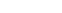

<div align="center">
  
</div>

<div align="center" style="margin:2.5vh 0;">
    
</div>

<div align="center">
  <a href="https://github.com/aulasoftwarelibre">
    -f41f4f?style=for-the-badge"
      alt="Built by developers" />
  </a>
  <a href="https://npmjs.org/package/@leivaa/simple-cqrs">
    
  </a>
</div>

## Contenidos

- [Levantar la aplicación en local](#local-deploy)
- [Añadir / modificar información](#modify-info)

<section id="local-deploy">

## Levantar la aplicación en local

Para levantar el entorno de desarrollo en local:

- `npm run dev` Levanta la web en el localhost:3000 con fastreload
- `npm run storybook` Levanta el storybook en el localhost:6006 con fastreload
- `docker compose up --build -d` Levanta ambos como imagenes de docker, con fastreload.

</section>

<section id="modify-info">

## Añadir / modificar información

En la carpeta de `data` se guarda toda la información sobre ponentes, patrocinadores y horario

### Ponentes

Para los ponentes, se debe de almacenar la imagen en la carpeta `public/speakers/` y añadir la información del ponente a `data/speakers.json` siguiendo el formato:

```json
{
  "name": "John Doe",
  "bio": "Frontend Lead for Doe Company",
  "urlPhoto": "/speakers/secondary-placeholder.png",
  "contacts": [
    { "type": "TWITTER", "link": "https://twitter.com" },
    { "type": "WEB", "link": "https://google.es" },
    { "type": "GITHUB", "link": "https://github.com" }
    { "type": "LINKEDIN", "link": "https://linkedin.com" }
  ]
}
```

Los tipos de contacto aceptados son `"TWITTER"`, `"WEB"`, `"GITHUB"` y `"LINKEDIN"`.

### Patrocinadores

Para los patrocinadores, de forma similar a los ponentes, debemos almacenar la imagen en la carpeta `public/sponsors` y añadir la información del sponsor a `data/sponsors.json` con el siguiente formato:

```json
{
  "name": "Aula de Software Libre",
  "type": "PERA",
  "imageUrl": "/sponsors/placeholder.png",
  "href": "/"
}
```

</section>
